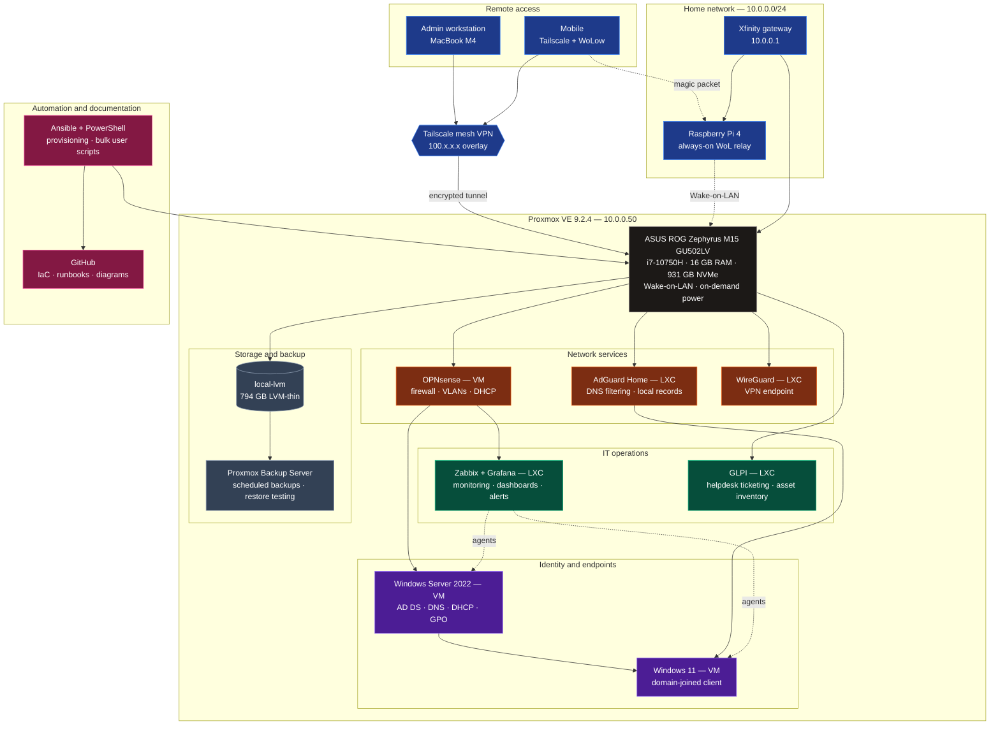

<table>
  <tr>
    <td style="background-color: transparent !important; border: none;">
      
    </td>
  </tr>
</table>

Servers Status:

<h2 align="center">Hardware:</h2>

<table width="100%" align="center">
  <tr>
    <!-- Main PC -->
    <td width="20%" align="center">
        
      <b>PC</b> 
      Ryzen 5 5600 
      RX 9060 XT 
      16GB RAM
    </td>
    <!-- MacBook Pro -->
    <td width="20%" align="center">
        
      <b>MacBook M4</b> 
      M4 Chip 
      macOS
    </td>
    <!-- Proxmox Laptop -->
    <td width="20%" align="center">
        
      <b>Proxmox</b> 
      Zephyrus M15 
      16GB RAM
    </td>
    <!-- RPI -->
    <td width="20%" align="center">
        
      <b>Raspberry Pi</b> 
      DietPi OS 
      8GB RAM
    </td>
    <!-- Oracle Cloud Server -->
    <td width="20%" align="center">
        
      <b>Oracle Cloud</b> 
      4 vCPU 
      24GB RAM
    </td>
  </tr>
</table>
